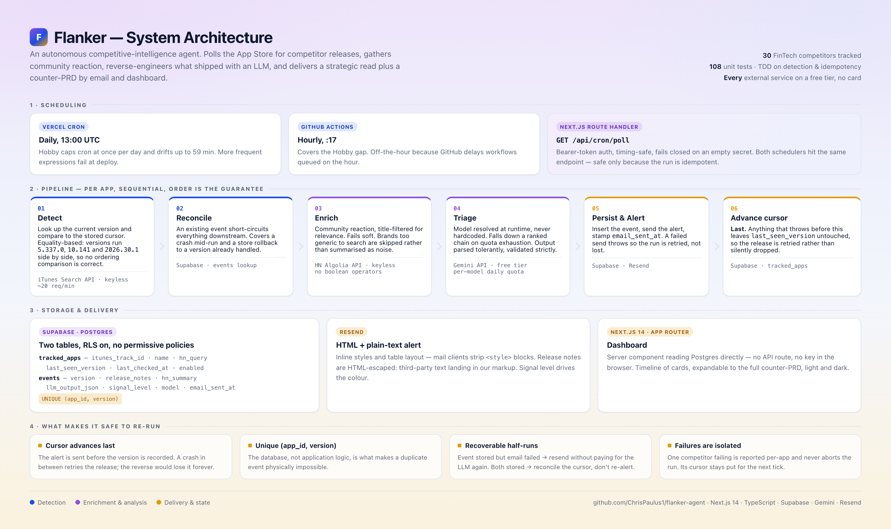

# Flanker

Autonomous AI agent that monitors FinTech competitors' live App Store releases,
reverse-engineers new features via LLM reasoning, and auto-drafts counter-PRDs
with market-reaction context — delivered by email.

Built with Next.js, Supabase, Gemini, Vercel Cron & Resend.

**Live dashboard: https://flanker-agent.vercel.app**

## Architecture

<!-- GitHub swaps these automatically with the reader's colour scheme. -->
<picture>
  <source media="(prefers-color-scheme: dark)" srcset="docs/architecture-dark.png">
  
</picture>

The diagram is authored as HTML in [docs/architecture.html](docs/architecture.html) and rendered
with `npm run diagram`, so it stays reviewable in a diff and can be regenerated when the system
changes. It shares the app's design tokens, so the two can't drift apart.

## What it does

For each of the 30 tracked competitors, on every run:

1. **Detect** — look up the current version via the iTunes Search API and
   compare it to the stored cursor.
2. **Reconcile** — an event already stored for that version short-circuits the
   run, which is what makes a re-run safe.
3. **Enrich** — search Hacker News for organic discussion of that competitor.
4. **Triage** — send the release notes plus reaction to Gemini with a structured
   prompt, and get back a signal level, feature analysis, strategic read and
   counter-PRD.
5. **Persist & alert** — store the event, then send a formatted HTML email.
6. **Advance the cursor** — last, and only after the alert has gone out.

The version cursor advances **only after** the alert has been sent, so a failure
anywhere in the pipeline means the release is retried rather than silently
dropped.

## Stack

| Concern | Choice |
| --- | --- |
| App | Next.js 14 (App Router), TypeScript |
| UI | Tailwind CSS, shadcn/ui, light + dark mode |
| Storage | Supabase (Postgres) |
| LLM | Gemini, model resolved at runtime |
| Email | Resend |
| Scheduling | Vercel Cron (daily) + GitHub Actions (hourly) |
| Sources | iTunes Search API, Hacker News Algolia API |

Every external service is on a free tier and none require a credit card.

## Code layout

```
src/lib/
  sources/     iTunes + Hacker News adapters
  llm/         model resolution, prompt, schema, tolerant parser
  storage/     Supabase repo behind a FlankerRepo interface
  email/       Resend adapter + HTML/text templates
  pipeline/    detection, orchestration, ports
```

`sources`, `storage`, `llm` and `email` are I/O adapters that know nothing about
each other. `pipeline/run.ts` is the only place they compose, and it takes its
dependencies as arguments — which is what lets the idempotency logic be tested
against in-memory fakes with no network, no database and no LLM spend.

## Getting started

```bash
nvm use                 # Node 22 — supabase-js requires it
npm install
cp .env.example .env.local
```

Fill in `.env.local`, then paste `supabase/schema.sql` into the Supabase SQL
editor and run it. It is idempotent and seeds the tracked competitor set.

Verify each layer independently:

```bash
npx tsx scripts/check-sources.ts   # live iTunes + HN, no keys needed
npx tsx scripts/check-storage.ts   # schema, seed data, unique constraint
npm run resolve-model              # which Gemini models this key can use
npx tsx scripts/check-triage.ts    # real triage, no DB writes
npx tsx scripts/check-email.ts     # sends one real email
```

Then run it:

```bash
npm run dev
curl -H "Authorization: Bearer $CRON_SECRET" http://localhost:3000/api/cron/poll
```

## Scripts

| Command | Purpose |
| --- | --- |
| `npm test` | Unit tests |
| `npm run backfill` | Populate history from every app's current version |
| `npm run simulate-release <app>` | Rewind memory so the next run re-detects a release |
| `npm run resolve-model` | Discover and verify an available Gemini model |
| `npm run discover-apps` | Resolve and validate competitor candidates against the App Store |
| `npm run seed-apps` | Sync the validated competitor set into Supabase |
| `npm run diagram` | Re-render the architecture diagram to PNG |

`simulate-release` fakes no API data. It only rewinds Flanker's own memory; the
pipeline then re-runs against whatever the App Store and HN actually return at
that moment. Pass `--keep-event` to leave the stored event in place, which
demonstrates the idempotency check rejecting the duplicate.

## Deployment

Import the repo on Vercel, set the environment variables from `.env.example`,
and deploy. `vercel.json` registers a daily cron; the hourly polling comes from
`.github/workflows/poll.yml`, which needs two repository secrets:

- `DEPLOYMENT_URL` — the production URL, no trailing slash
- `CRON_SECRET` — the same value as the Vercel environment variable

## Notes from building this

Things that were true in practice and not obvious up front:

- **Algolia's HN index has no boolean operators.** A query of
  `"Chime" AND (bank OR fintech)` returns zero hits — `AND`, `OR` and the
  parentheses are matched as literal words. Queries are plain phrases, and
  disambiguation happens client-side by requiring the phrase in the story title.
- **HN reaction is usually absent**, and some brand names ("Current") are
  unsearchable entirely. Both cases render an explicit empty state rather than
  letting the model invent sentiment.
- **Most releases are filler.** "Bug Fixes and Improvements" is a real, current
  release note. The prompt is written to make *low signal* a comfortable answer,
  because a prompt that inflates every bugfix into a strategic threat produces a
  dashboard nobody reads.
- **Gemini's free tier is per-model per-day** and small. The engine ranks
  available models, tries them in order, and degrades on quota exhaustion —
  which happened on the very first live run. Events record which model answered.
- **Vercel Hobby caps cron at once per day**, hence the GitHub Actions companion.
- **Newer Supabase projects don't auto-grant** table privileges to `service_role`
  for tables created in the SQL editor; without explicit `GRANT`s every request
  returns `42501`.

## Licence

MIT
